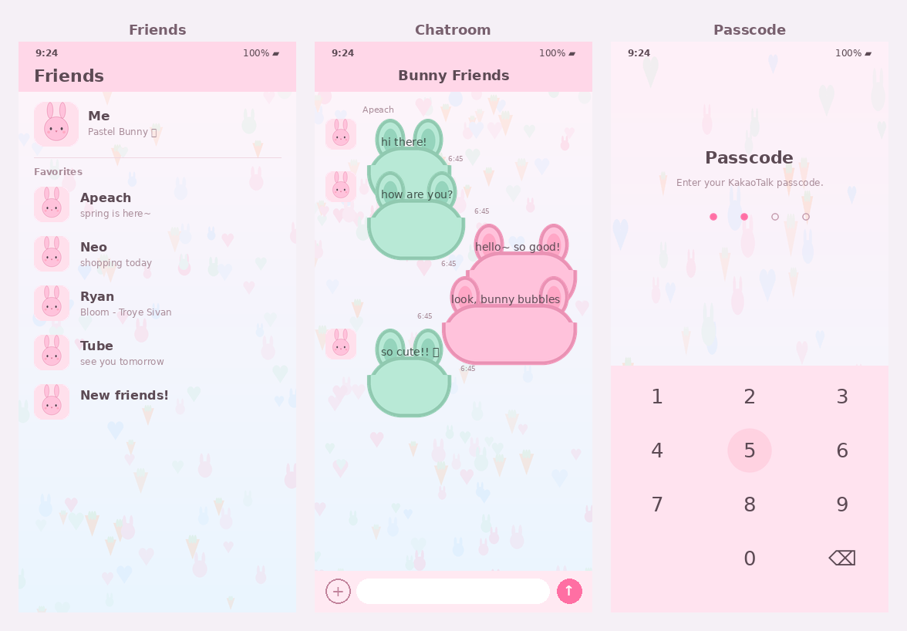
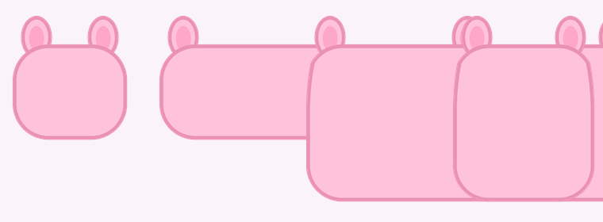

# 🐰 Pastel Bunny — KakaoTalk iOS Theme

A soft pastel theme for **KakaoTalk on iOS**, built to the official
*KakaoTalk 8.0.0 iOS Theme User Guide*. The chat bubbles are little bunnies
with two short ears:

- **Sender bubble → pink bunny** 🩷
- **Receiver bubble → mint bunny** 🌿



*Friends list · Chatroom · Passcode — rendered from the actual generated assets.*

The ears sit in the bubble's top corners, which fall inside the 9-slice
stretch cap, so they never distort when KakaoTalk resizes a bubble:



---

## How an iOS KakaoTalk theme works

A `.ktheme` is a **ZIP** containing `KakaoTalkTheme.css` (fixed name, at the
root) plus an `Images/` folder. Per the official guide:

- **Colors** are hex values (`#rrggbb`) in the CSS.
- **Images** are **2×-based** — ship `name@2x.png` + `name@3x.png`; the CSS
  references the bare name (`'mainBgImage.png'`) and KakaoTalk picks the
  variant.
- **Insets/caps** in the CSS are **1×-based**, order `top left bottom right`.
- Chat bubbles use a 9-slice cap: `'chatroomBubbleSend01.png' 20px 20px`,
  with `-ios-title-edgeinsets` controlling text padding.

The CSS selectors (Manifest, `HeaderStyle-Main`, `MainViewStyle-*`,
`TabBarStyle-Main`, `BackgroundStyle-ChatRoom`, `MessageCellStyle-Send/
Receive`, `PasscodeStyle`, notification/share bars, …) follow the guide.

---

## Repository layout

```
theme/
  KakaoTalkTheme.css          # stylesheet (edit colors here)
  Images/                     # generated PNG assets (@2x/@3x)
scripts/
  generate_images.py          # draws bunny bubbles, bg, icons, passcode (Pillow)
  preview_pages.py            # renders preview/pages.png mockups
  analyze_theme.py            # validates a .ktheme (consistency + retina)
  build.sh                    # packages theme/ -> dist/PastelBunny.ktheme
preview/                      # pages.png, verify_stretch.png, thumbnail.png
```

---

## Build

Requires Python 3 + Pillow and `zip`.

```bash
pip install Pillow
./scripts/build.sh                 # -> dist/PastelBunny.ktheme
python3 scripts/analyze_theme.py dist/PastelBunny.ktheme   # optional check
python3 scripts/preview_pages.py   # optional: regenerate page mockups
```

---

## Install on your iPhone

Per the official guide, custom themes install through a **Safari link**, not
straight from the Files app:

1. Upload `dist/PastelBunny.ktheme` somewhere you can download it from a URL
   (or send it to yourself via KakaoTalk).
2. On the iPhone, open that **URL in Safari** (or tap the link).
3. Tap **Open in KakaoTalk** when prompted — the theme installs.
4. KakaoTalk → **More (⋯) → Settings → Theme** → select **Pastel Bunny**.

> Requires KakaoTalk 8.0.0+. Custom themes change images/colors only
> (layout is fixed). If a KakaoTalk update blocks a custom theme, rebuild
> and re-import.

---

## Customizing

- **Colors:** edit the hex values in `theme/KakaoTalkTheme.css`.
- **Bubble / ear colors:** the palette constants at the top of
  `scripts/generate_images.py` (`PINK`, `MINT`, ear/outline colors).
- **Background pattern:** `pattern_bg` density and `BG_TOP/BG_BOT`.
- **Tab icons:** the `gi_*` functions; `MUTED`/`ACCENT` set normal/selected.

After any change: `./scripts/build.sh`.
