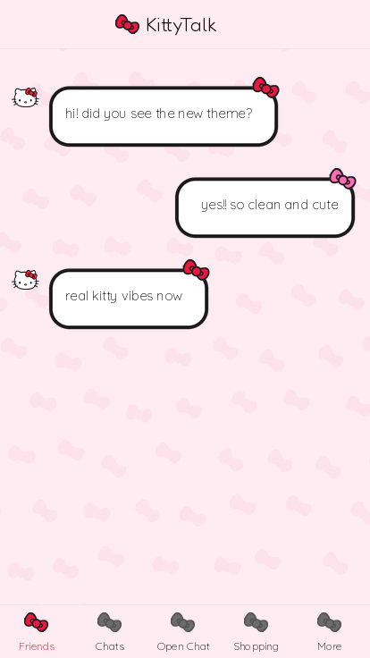
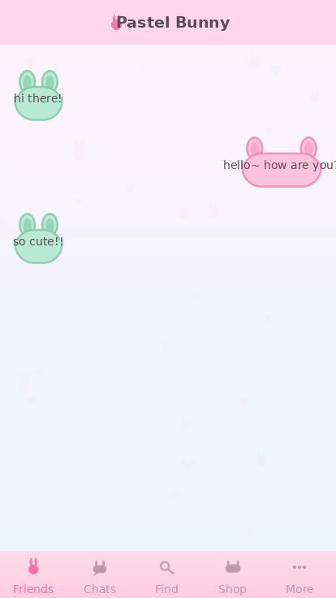
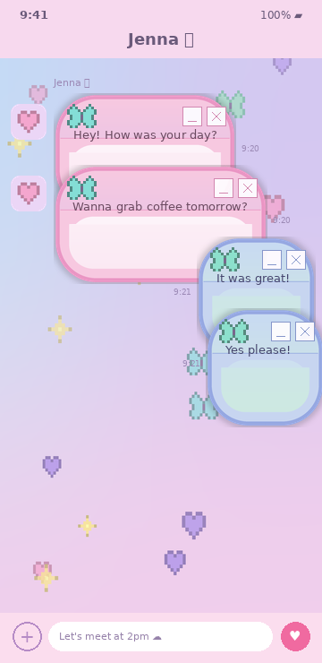

# KakaoTalk iOS Themes

Custom **KakaoTalk for iOS** themes, each built to the official
*KakaoTalk 8.0.0 iOS Theme User Guide*. Every theme ships as a reproducible
`.ktheme` package — all PNG assets are generated from code (Pillow), so there
are no binary art blobs to hand-edit.

## Themes

| Theme | Folder | Look |
|-------|--------|------|
| 🎀 **KittyTalk** | [`themes/kittytalk`](themes/kittytalk) | Minimal Sanrio × Apple — white, black outlines, red bows |
| 🐰 **Pastel Bunny** | [`themes/pastel-bunny`](themes/pastel-bunny) | Soft pastel bunnies — pink sender / mint receiver bubbles |
| 🦋 **Pixel Daydream** | [`themes/pixel-daydream`](themes/pixel-daydream) | Dreamy y2k pastel — pink→lavender→blue gradients, pixel butterflies/hearts, retro "chat window" bubbles |

<p align="center">
  
  
  
</p>

---

## How an iOS KakaoTalk theme works

A `.ktheme` is a **ZIP** containing `KakaoTalkTheme.css` (fixed name, at the
root) plus an `Images/` folder. Per the official guide:

- **Colors** are hex values (`#rrggbb`) in the CSS.
- **Images** are **2×-based** — ship `name@2x.png` + `name@3x.png`; the CSS
  references the bare name (`'mainBgImage.png'`) and KakaoTalk picks the
  variant.
- **Insets/caps** in the CSS are **1×-based**, order `top left bottom right`.
- Chat bubbles use a 9-slice cap: `'chatroomBubbleSend01.png' 20px 20px`,
  with `-ios-title-edgeinsets` controlling text padding. Anything inside the
  corner cap (e.g. a bow) is preserved as-is when the bubble stretches.

> **Fonts:** KakaoTalk renders all in-app text in the system font — the
> `.ktheme` format has no font property, so a theme can't replace the chat
> font. Bundled fonts (e.g. KittyTalk's Fredoka) are used only for the
> wordmark and preview artwork.

---

## Repository layout

```
themes/
  <theme-name>/
    KakaoTalkTheme.css        # stylesheet (all colors live here)
    Images/                   # generated PNG assets (@2x/@3x)
    manifest.json             # source metadata (not shipped in the .ktheme)
    scripts/
      generate_images.py      # draws every asset for this theme (Pillow)
    preview/                  # preview.png, thumbnail.png, verify_stretch.png
    assets/                   # source extras (e.g. fonts)
scripts/
  build.sh                    # build.sh [theme] -> dist/<Name>.ktheme
  analyze_theme.py            # validates a .ktheme (consistency + retina)
```

---

## Build

Requires Python 3 + Pillow and `zip`.

```bash
pip install Pillow

./scripts/build.sh                 # build every theme -> dist/*.ktheme
./scripts/build.sh kittytalk       # build just one theme

python3 scripts/analyze_theme.py dist/KittyTalk.ktheme   # optional check
```

`build.sh` regenerates that theme's images, then zips `KakaoTalkTheme.css` +
`Images/` into `dist/<ThemeName>.ktheme` (the package name comes from the
`-kakaotalk-theme-name` in the CSS). `dist/` is git-ignored — the package is
always reproducible from source.

---

## Install on your iPhone

Per the official guide, custom themes install through a **Safari link**, not
straight from the Files app:

1. Upload the `.ktheme` somewhere you can download it from a URL (or send it
   to yourself via KakaoTalk).
2. On the iPhone, open that **URL in Safari** (or tap the link).
3. Tap **Open in KakaoTalk** when prompted — the theme installs.
4. KakaoTalk → **More (⋯) → Settings → Theme** → select the theme.

> Requires KakaoTalk 8.0.0+. Custom themes change images/colors only
> (layout is fixed). If a KakaoTalk update blocks a custom theme, rebuild
> and re-import.

---

## Adding a new theme

1. Copy an existing folder under `themes/` as a starting point.
2. Edit the palette/artwork in `scripts/generate_images.py` and the colors in
   `KakaoTalkTheme.css`.
3. `./scripts/build.sh <your-theme>` and check it with `analyze_theme.py`.
