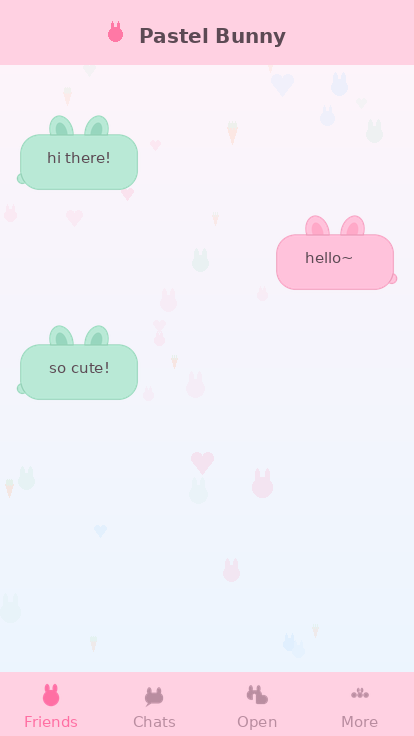

# 🐰 Pastel Bunny — KakaoTalk iOS Theme

A soft, cute pastel theme for **KakaoTalk on iOS**. The chat bubbles are
shaped like little bunnies with two short ears:

- **Sender bubble → pink bunny** 🩷
- **Receiver bubble → mint bunny** 🌿



> The mockup above is rendered from the actual generated bubble PNGs.

---

## How iOS KakaoTalk themes work

An iOS theme is a **`.ktheme`** file, which is simply a **ZIP archive** whose
extension has been renamed. Inside it:

```
PastelBunny.ktheme  (zip)
├── KakaoTalkTheme.css        ← fixed filename; defines colors + image references
└── Images/              ← PNG assets, with @2x and @3x Retina variants
    ├── chatBubbleSent.png        (+@2x/@3x)   pink bunny
    ├── chatBubbleReceived.png    (+@2x/@3x)   mint bunny
    ├── bg_chatroom*.png                       bunny/heart/carrot pattern
    ├── bg_friends*.png / bg_chats*.png        lighter matching pattern
    ├── tab_{friends,chats,openchat,more}.png  bunny tab icons
    │   + each tab_*_on.png (selected, pink)   (all +@2x/@3x)
    └── thumbnail*.png                         theme-list tile
```

The theme tile shown in KakaoTalk's theme list:


Styling uses Kakao's custom `-ios-*` CSS properties (e.g.
`-ios-background-image`, `-ios-text-color`).

---

## Repository layout

```
.
├── theme/
│   ├── KakaoTalkTheme.css          # the stylesheet (edit colors here)
│   └── Images/                # generated PNG assets
├── scripts/
│   ├── generate_images.py     # draws the bunny bubbles + backgrounds (Pillow)
│   └── build.sh               # packages theme/ into dist/PastelBunny.ktheme
├── preview/preview.png        # rendered mockup
└── README.md
```

---

## Build it

Requires Python 3 with [Pillow](https://pypi.org/project/Pillow/) and `zip`.

```bash
pip install Pillow
./scripts/build.sh
```

This regenerates the images and produces **`dist/PastelBunny.ktheme`**.

> Tip: to package by hand instead, zip the **contents** of `theme/` (so that
> `KakaoTalkTheme.css` and `Images/` are at the zip root) and rename the `.zip` to
> `.ktheme`.

---

## Install on your iPhone

1. Get `dist/PastelBunny.ktheme` onto your phone (AirDrop, email it to
   yourself, or save to the Files app).
2. Open the file and choose **Open in KakaoTalk** (or share → KakaoTalk).
3. In KakaoTalk: **More (⋯) → Settings → Display/Theme**, then select
   **Pastel Bunny** and apply.

Custom (non-store) themes only apply while KakaoTalk allows third-party
themes; if a theme doesn't show up after a KakaoTalk update, rebuild and
re-import.

---

## Customizing

- **Colors:** edit the hex values in `theme/KakaoTalkTheme.css`.
- **Bubble shape/colors:** edit the palette constants at the top of
  `scripts/generate_images.py` (`PINK`, `MINT`, ear/outline colors), then
  rerun the build.
- **Backgrounds:** tweak `BG_TOP` / `BG_BOT` and the `cute_pattern`
  density (and the motif palette/shapes) in the same script.
- **Tab icons:** the `icon_*` functions in `generate_images.py` draw the
  bunny tab silhouettes; `TAB_OFF` / `TAB_ON` set the normal/selected colors.

---

## Notes & accuracy

KakaoTalk's **complete** iOS selector list lives in their official theme
guide PDF (the *KakaoTalk iOS Theme User Guide*). This project implements the
commonly-used selectors; if a KakaoTalk version renames a CSS class, update
just the selector name in `KakaoTalkTheme.css` — the palette and images are
independent of that. The `-ios-background-image-cap-insets` values on the
bubbles control which parts stretch (the body) vs. stay fixed (the ears);
nudge them if a long message distorts the ears.

Official guides for reference:
- [Install KakaoTalk themes (iOS) — webudding guide](https://guide.webudding.com/315e0ebc-6cd3-45df-be87-1a99023c9592)
- KakaoTalk iOS Theme User Guide (PDF, from kakaocdn — search "KakaoTalk iOS Theme User Guide")
